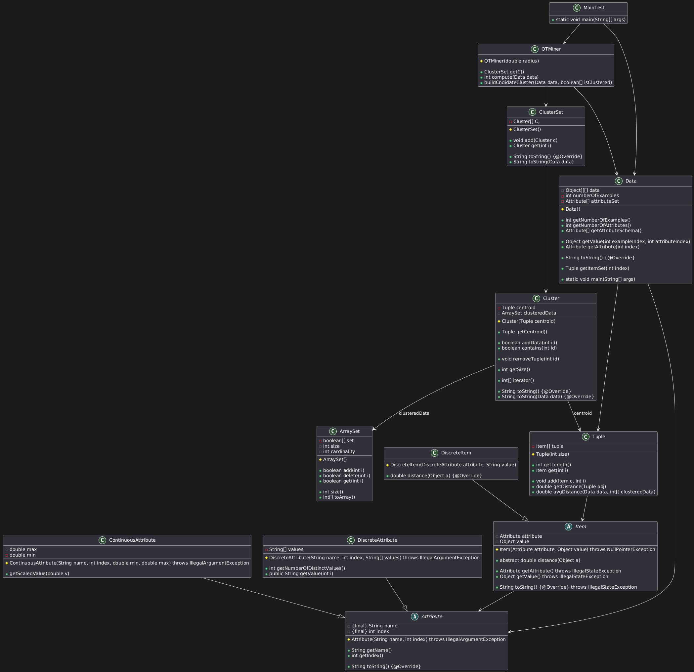

# QT

  

___

Repository per il **progetto di gruppo** su cluster, per l’insegnamento di *Metodi Avanzati di Programmazione*, A.A. 2024‑2025.

### Collaboratori:
- Mirco Saverio Catalano (`@catalanomircosav`)
- Lorenzo Amato (`@loremat`)

___

### Sprint completati
- Sprint 1 (QT1): modellazione e implementazione delle classi principali (`Attribute`, `ContinuousAttribute`, `DiscreteAttribute`, `Data`) e definizione del relativo diagramma UML.
- Sprint 2 (QT2): modellazione e implementazione delle classi per mining (`Cluster`, `ClusterSet`,`QTMiner`,`ArraySet`) e
aggiornamento del relativo diagramma UML.
___

